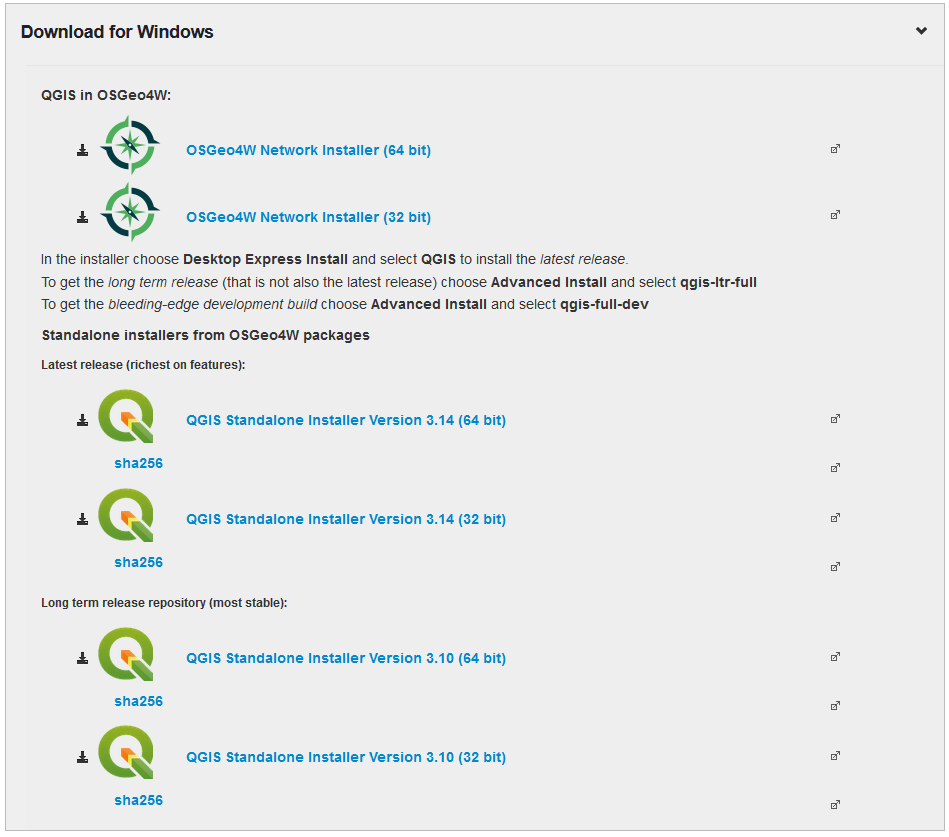

## Installation

### PC Installation

The QGIS program can be downloaded from the QGIS Project website http://www.qgis.org/en/site/and a choice can be made between 32 and 64 bit versions of the recent release and long term release versions.Note that the v2 options are no longer supported and users and encouraged to use v 3.The Standalone Installers will install the program into the Program Files directory.

The OSGeo4W (Open source geospatial for Windows) option can be also be used and places a small executable file on your PC which can be run when desired to update to the latest versions of the LTR and development versions. This version installs the software into the root directory of your PC (e.g. C:\OSGeo4W64). For first-time users, it is recommended to install the “Standalone” version.

